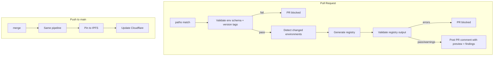

# Registry Documentation

This folder contains everything for Centrifuge's contract registry: scripts that generate and pin registries, CI pipelines that keep them up to date, and the JSON schema they follow.

## Delta Registry Format

Registries use a **delta format**: each version only contains contracts that changed since the previous version. Each delta has a `previousRegistry` field with an IPFS hash to the prior version, forming a linked chain. This enables selective loading, version-aware indexing (each delta has a `startBlock`), and full reconstruction by walking the IPFS chain.

## Endpoints and outputs

- **Published:** `registry.centrifuge.io` (mainnet), `registry.testnet.centrifuge.io` (testnet). Each serves a JSON file with the schema below.
- **Generated files:** `registry-mainnet.json`, `registry-testnet.json` (production and testnet deployments).

---

## How it works

### Scripts

| Script | Purpose |
|--------|---------|
| `abi-registry.js` | Builds `registry-*.json` from env files, explorer APIs, and per-tag Forge ABI caches. Supports delta (default) or full snapshot. |
| `utils/abi-cache.js` | Per-tag Forge ABI cache (worktrees + `forge build`); env key → artifact names (`ABI_NAME_ALIASES` / `resolveArtifactName` / `artifactNamesForContractKey`). See [ABI cache layout](#abi-cache-layout-repo-root). |
| `build-abi-cache.js` | CLI to warm the cache: `node script/registry/build-abi-cache.js <git-tag> [...]` (from repo root). |
| `utils/tag-resolution.js` | Shared helpers: map env contract `version` → git tag (used by `abi-registry.js` and CI). |
| `utils/validate-env-contract-version-tags.js` | CI pre-check: every mainnet/testnet contract must have `version` and a matching local git tag (run after `git fetch --tags`). |
| `validate-env-schema.js` | Validates all `env/*.json` against the expected schema, including `deploymentInfo.*.startBlock` vs contract `blockNumber` gap (chain-level indexer listeners). Fast-fail gate before generation. |
| `validate-registry.js` | Validates generated registry JSON against indexer hard requirements. Sidecar `.validation.json` for PR comments. Uses the same artifact naming as `packAbis` via `utils/abi-cache.js`. |
| `pin-to-ipfs.js` | Pins generated registries to Pinata, outputs CID metadata. |
| `validate-api-keys.js` | Read-only validation of Pinata and Cloudflare credentials. |
| `.github/ci-scripts/detect-changed-environments.js` | Detects mainnet/testnet env changes to skip unnecessary CI builds. |
| `.github/ci-scripts/detect-deployment-commit.js` | Returns the git commit recorded in env `deploymentInfo` (used as `DEPLOYMENT_COMMIT` / `registry.deploymentInfo.gitCommit`, not for per-contract ABI tags). |
| `.github/ci-scripts/compute-env-tags.js` | Creates tags (`deploy-${version}-${timestamp}`) when env files change so deployment commits stay reachable after squashing. |

### CI Pipeline

The `registry.yml` workflow runs on changes under `env/**`, `script/registry/**`, `.github/ci-scripts/**`, or the workflow file. It fetches git tags, validates env contract versions, runs `abi-registry.js` (per-tag ABI caches via worktrees), validates output, and on pull requests posts a **Registry Preview** comment. Pushes to `main` also pin to IPFS and update Cloudflare DNS.

```
pull_request  → validate env + versions → generate registry → validate output → post PR comment
push to main  → same generate/validate path → pin to IPFS → update Cloudflare DNS
workflow_dispatch → manual run (same pipeline)
```

**Pipeline flow:**



**Validation layers:**

1. **`validate-env-schema.js`** (pre-generation) — broken JSON, missing `network.chainId`, invalid addresses, structural renames, and **`deploymentInfo.*.startBlock` vs contract `blockNumber` gap**. Fails the workflow immediately.
2. **`validate-env-contract-version-tags.js`** — every mainnet/testnet contract has a `version` that resolves to a local git tag (ABI cache). Requires `git fetch --tags` in CI.
3. **`validate-registry.js`** (post-generation) — indexer hard requirements on the generated JSON; writes `.validation.json` for the PR comment.

**Other workflows:**
- **`tag-env-updates.yml`** – On any push that touches `env/**/*.json`: runs `compute-env-tags.js` and pushes annotated tags.

---

## ABI cache layout (repo root)

All paths are relative to the **protocol repository root** (`process.cwd()` when you run the scripts). The cache is **gitignored** (`/cache/` in `.gitignore`).

```
cache/abi-registry/                    # getAbiCacheRoot() — stable cache
  <git-tag>/                           # Resolved tag string, e.g. v3.1.0 or v3
    out/                               # Full Forge output tree (copied after build)
      <source-dir>/                    # Mirrors forge artifact paths, e.g. src/core/hub/Hub.sol/
        <ContractName>.json            # Standard Foundry JSON artifact; use .abi for the ABI array
      ...
  worktrees/                           # Only exists briefly while a tag is being built
    <git-tag>/                         # git worktree at that ref; submodule init + forge build here
```

**Lifecycle**

1. **`ensureAbiCache(tag)`** (in `utils/abi-cache.js`): if `cache/abi-registry/<tag>/out/` already exists → no-op (cache hit).
2. Otherwise: create `worktrees/<tag>/` via `git worktree add`, `git submodule update --init --recursive`, `forge build --skip test`, copy `worktrees/<tag>/out/` → `<tag>/out/`, then remove the worktree directory.

**Reading ABIs programmatically**

- Per-tag output directory: **`cache/abi-registry/<tag>/out/`** (same shape as a normal `out/` after `forge build`).
- Contract JSON basename usually matches the Solidity contract name (e.g. `Hub.json`). Env/registry keys that differ from artifact names use **`ABI_NAME_ALIASES`** → **`resolveArtifactName()`** → **`artifactNamesForContractKey()`** in `utils/abi-cache.js` (single table; `validate-registry.js` and `packAbis` share it). Example: `fullRestrictionsHook` → `FullRestrictions`.
- **`findAbiInOutput(outDir, artifactName)`** scans immediate subdirs of `out/` (skips `*.t.sol`), loads `<artifactName>.json`, returns `parsed.abi`.

**Warm cache without generating a registry**

```bash
node script/registry/build-abi-cache.js v3.1.0 v3
```

---

## Generating registries locally

**ABIs are built per contract version tag.** Each contract in `env/*.json` has a `version` field (e.g. `"3"`, `"v3.1"`). The script resolves each version to a git tag, builds ABIs from that tag using a worktree, and caches the `out/` artifacts in `cache/abi-registry/<tag>/out/` as described [above](#abi-cache-layout-repo-root). This ensures mixed-version deployments get the correct ABI for every contract. **Every contract version must have a corresponding git tag** or the build will fail.

**No manual `forge build` step is required.** The script handles it automatically per tag. Cached builds are reused on subsequent runs; delete `cache/abi-registry/` to force a full rebuild.

**Delta (default)** – only contracts that changed since the previous version:

```bash
ETHERSCAN_API_KEY=<key> \
node script/registry/abi-registry.js mainnet

# testnet
ETHERSCAN_API_KEY=<key> \
node script/registry/abi-registry.js testnet
```

**Full snapshot** – all contracts, no delta; use for base registry or first version in a new format:

```bash
ETHERSCAN_API_KEY=<key> \
node script/registry/abi-registry.js mainnet --full
```

**Delta with custom previous registry** – fix a broken delta or test against a specific version:

```bash
ETHERSCAN_API_KEY=<key> \
SOURCE_IPFS=<previous-cid> \
node script/registry/abi-registry.js testnet
```

**Finding the `SOURCE_IPFS` value**

In normal delta mode you don't need it — the script resolves the current live CID automatically via the `_dnslink` TXT record on the registry hostname. `SOURCE_IPFS` is only needed when you want to compare against a **specific** older version (e.g. to regenerate a broken delta or test against a pinned CID).

The three ways to find it:

```bash
# 1. DNS dnslink — what the live endpoint currently points to (same as the script uses internally)
dig TXT _dnslink.registry.centrifuge.io +short          # mainnet
dig TXT _dnslink.registry.testnet.centrifuge.io +short  # testnet
# Returns: "dnslink=/ipfs/<CID>" → use the <CID> part

# 2. Live registry JSON — the CID of the *previous* version in the linked chain
curl -s https://registry.centrifuge.io | jq '.previousRegistry.ipfsHash'

# 3. Walk the chain — to go further back, follow .previousRegistry.ipfsHash recursively
curl -s https://ipfs.centrifuge.io/ipfs/<CID> | jq '.previousRegistry.ipfsHash'
```

**Env / flags:** `DEPLOYMENT_COMMIT` (metadata only), `ETHERSCAN_API_KEY` (required), `REGISTRY_MODE=full`, `SOURCE_IPFS`; `--full`, `--source-url=<url>`. For pinning: `PINATA_JWT` (1Password, limited access).

### Validating env files and registries locally

```bash
# Validate all env/*.json files against expected schema
node script/registry/validate-env-schema.js

# Validate a generated registry against indexer hard requirements
node script/registry/validate-registry.js registry/registry-mainnet.json
node script/registry/validate-registry.js registry/registry-testnet.json

# Skip live registry fetch (offline mode)
SKIP_LIVE_REGISTRY_CHECK=1 node script/registry/validate-registry.js registry/registry-mainnet.json
```

### Testing API keys (no changes made)

To confirm Pinata and Cloudflare credentials work without modifying DNS or pinning new files:

```bash
cd script/registry && npm install
```

- **Pinata (read):** `PINATA_JWT=<jwt> node validate-api-keys.js` — lists pins (read-only).
- **Cloudflare (read):** `CLOUDFLARE_ZONE_ID=<id> CLOUDFLARE_API_TOKEN=<token> node validate-api-keys.js` — lists Web3 hostnames. Use the **zone** ID (from the zone’s Overview), not the account ID. If you see "Invalid API Token" but the token works in the dashboard, set `CLOUDFLARE_ACCOUNT_ID` to your **account** ID (from the token’s verify URL or dashboard); the script will then use the account-scoped verify endpoint.
- **Cloudflare (prove write, no-op):** same env plus `--test-write` — PATCHes each hostname with its current dnslink so nothing changes, but confirms the token can write.
- **Both:** set all three env vars and run `node validate-api-keys.js` (optionally `--test-write` for Cloudflare).

Use `--pinata-only` or `--cloudflare-only` to test a single provider. If you see "Invalid API Token", ensure the token is active, not expired, and copied in full; create a new token in Cloudflare if needed.

**Equivalent curl commands (Cloudflare):** Use your **account** ID for verify and **zone** ID for hostnames.

```bash
# 1. Token verify (account-scoped token: use account ID in URL)
curl -s "https://api.cloudflare.com/client/v4/accounts/ACCOUNT_ID/tokens/verify" \
  -H "Authorization: Bearer $CLOUDFLARE_API_TOKEN"

# 2. List Web3 hostnames (use zone ID)
curl -s "https://api.cloudflare.com/client/v4/zones/ZONE_ID/web3/hostnames" \
  -H "Authorization: Bearer $CLOUDFLARE_API_TOKEN"
```

If (1) works but the script fails at step 1/5, set `CLOUDFLARE_ACCOUNT_ID` to your account ID so the script uses the same verify URL.

---

## Registry consumption

**Selective loading (indexers):** Use the latest delta; swap ABIs only for contracts that changed at the delta’s block.

**Full reconstruction:** Walk `previousRegistry.ipfsHash` backwards from the latest registry URL, then merge `abis` and `chains` (older first, newer overrides).

**Single version:** Import the JSON; use `registry.abis.<ContractName>`, `registry.chains[chainId].contracts.<name>.address`, and optional `blockNumber` / `txHash` for deployment metadata.

**Deprecated contracts:** When a contract existed in the previous registry but was removed from `env/*.json` (rename, merge, or retirement), the delta includes that key with `address: null`. No ABI is shipped for that entry in the delta (the prior registry already carried it). Downstream indexers (e.g. [api-v3](https://github.com/centrifuge/api-v3)) must treat `null` as “stop indexing this logical contract from this version’s deployment boundary”; concrete wiring is left to those projects.

---

## Example: delta JSON with deprecated contracts

Below is a **trimmed** illustration of what a delta looks like when some v3.0 contracts were removed or renamed in v3.1. Only chains that have changes appear under `chains`. Deprecated entries sit next to normal ones; `abis` only lists contracts that need new or updated ABIs in this delta (not the deprecated keys).

```json
{
  "network": "mainnet",
  "version": "v3.1",
  "deploymentInfo": {
    "gitCommit": "c89c55ff6"
  },
  "previousRegistry": {
    "version": "3",
    "ipfsHash": "bafybeief457bljpdmydiyizgyck6bwf2a5y2rfnlhxsqzxosdlaecokogu"
  },
  "abis": {
    "Hub": [ "..." ],
    "Spoke": [ "..." ]
  },
  "chains": {
    "1": {
      "network": {
        "chainId": 1,
        "centrifugeId": 0
      },
      "adapters": {},
      "contracts": {
        "guardian": {
          "address": null,
          "blockNumber": null,
          "txHash": null
        },
        "globalEscrow": {
          "address": null,
          "blockNumber": null,
          "txHash": null
        },
        "hub": {
          "address": "0xA4A7Bb3831958463b3FE3E27A6a160F764341953",
          "blockNumber": 24319335,
          "txHash": "0xcd4e039f241549031a78668d74cc76c4cbd7398c2686c42969a69be73c963976"
        }
      },
      "deployment": {
        "deployedAt": 1737893250,
        "startBlock": 24319298
      }
    }
  }
}
```

**How this is produced:** In delta mode, `abi-registry.js` compares local `env/*.json` to the previous registry (live endpoint or `SOURCE_IPFS=<cid>`). Any contract name present in the previous registry’s chain but **missing** from the current env for that chain is emitted as above with all-null fields. Regenerating against the v3.0 IPFS pin while env reflects v3.1 yields real rows such as `guardian`, `hubHelpers`, `routerEscrow`, and `globalEscrow` on affected chains.

---

## Schema

```typescript
interface Registry {
  network: "mainnet" | "testnet";
  version?: string;             // e.g. "v3.1.0"; omitted if unknown
  deploymentInfo: {
    gitCommit: string;          // Git commit hash used to build the ABIs
  };
  previousRegistry: {           // null for first/base registry
    version: string;            // Version of the previous registry
    ipfsHash: string;           // IPFS CID to fetch the previous registry
  } | null;
  abis: {
    [contractName: string]: AbiItem[];  // ABIs for contracts that changed in this version
  };
  chains: {
    [chainId: string]: ChainConfig;     // Only chains with changed contracts
  };
}

interface ChainConfig {
  network: {
    chainId: number;
    centrifugeId: number;       // Internal Centrifuge chain identifier
    protocolAdmin?: string;     // multisig safe admin address
    opsAdmin?: string;          // multisig safe admin address
  };
  adapters: {
    wormhole?: {
      wormholeId: string;
      relayer: string;
    };
    axelar?: {
      axelarId: string;
      gateway: string | null;
      gasService: string | null;
    };
    layerZero?: {
      endpoint: string;
      layerZeroEid: number;
    };
  };
  contracts: {
    [contractName: string]: {
      address: string | null;      // null = contract deprecated in this version
      blockNumber: number | null;  // Block number at contract creation
      txHash: string | null;       // Transaction hash of contract deployment
    };
  };
  deployment: {
    deployedAt: number | null;     // Unix timestamp (seconds) when the last deployment finished
    startBlock: number | null;     // Block before deployment started (for indexing)
  };
}
```

### Indexer hard requirements (`validate-registry.js`)

These rules apply to **active** contracts (`address` is a non-null string). **Deprecated** delta entries (`address: null`) skip address/blockNumber/ABI checks — they signal retirement; the prior registry already carried the ABI.

| Field | Rule |
|-------|------|
| `version` | Non-empty string. Identifies the registry in the ordered version chain. |
| `previousRegistry.ipfsHash` | Non-null when a live registry exists for that network (linked list); omit only for the first/base registry. |
| `chains.<chainId>.deployment.startBlock` | Must be a number. Source: `env/*.json` → `deploymentInfo.*.startBlock`. **Gap rule** vs contract `blockNumber` values: enforced in **`validate-env-schema.js`** before generation (chain-level listeners / snapshots). |
| `chains.<chainId>.contracts.<name>.address` | Non-empty string for **active** contracts; `null` only for deprecations. |
| `chains.<chainId>.contracts.<name>.blockNumber` | Must be a number for active contracts. |
| `abis.<ArtifactName>` | Must exist for every **active** contract in `chains` (and factory implementation ABIs where applicable). Artifact basenames = `artifactNamesForContractKey()` / `resolveArtifactName()` in `utils/abi-cache.js` — same as `packAbis` (e.g. `fullRestrictionsHook` → `FullRestrictions`). |

**Other / soft fields:** `txHash`, `deployment.deployedAt`, `deploymentInfo.gitCommit`, `previousRegistry.version`, and `adapters` are not hard-gated the same way; see validator output for warnings.

**Deprecated contracts:** `address`, `blockNumber`, and `txHash` may be `null`; no ABI is required in the delta for that key (see [example](#example-delta-json-with-deprecated-contracts)).
